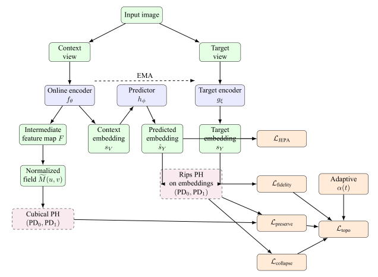

# TopoJEPA

TopoJEPA is a **topology-regularized joint embedding predictive architecture** for road damage detection and related crack-oriented vision tasks. It combines JEPA-style representation learning with **persistent homology** regularization so the learned embeddings remain semantically aligned while preserving topological structure.


---

## Overview

TopoJEPA follows a two-stage training pipeline:

1. **Stage 1 — representation learning**
   - Online visual encoder predicts the target embedding.
   - Topological loss constrains the embedding space.
   - No detection head is used.

2. **Stage 2 — task fine-tuning**
   - The model is fine-tuned for detection.
   - A lightweight neck and detection head are enabled.
   - Topological regularization is still applied.

### Core idea

- **JEPA loss** keeps predicted and target embeddings aligned.
- **Topological loss** preserves persistence structure and prevents collapse.
- **Adaptive topology weight** balances representation learning and topology constraints during training.

---

## Paper figures


### Architecture





---

## Features

- **Topology-aware representation learning** with persistent homology
- **Dual-space topology** over embeddings and intermediate feature maps
- **Adaptive topology weighting** during training
- **Stage 2 detection fine-tuning** for road damage detection
- **Fallback tokenizer and PH backends** for offline or dependency-limited environments
- **Visualization utilities** for persistence diagrams, Betti curves, and training curves

---

## Repository structure

```text
TopoJEPA/
  configs/                # Training and experiment configs
  data/                   # Dataset adapters and transforms
  losses/                 # JEPA, topology, and detection losses
  models/                 # Encoders, predictor, topology branch, heads
  utils/                  # EMA, metrics, schedulers, visualization
  train.py                # Training entry point
  eval_topojepa.py        # Evaluation entry point
  README.md               # Project overview and usage
```

---

## Installation

Install the Python dependencies from the project root:

```bash
pip install -r requirements.txt
```

Recommended packages:

- `torch`
- `ultralytics`
- `numpy`
- `opencv-python`
- `PyYAML`

Optional but recommended:

- `sentence-transformers`
- `gudhi`
- `giotto-tda`
- `matplotlib`

---

## Data preparation

### RDD dataset

This project currently targets **RDD-style YOLO labels**.

Expected structure:

```text
RDD_SPLIT/
  train/
    images/
    labels/
  val/
    images/
    labels/
  test/
    images/
    labels/
```

Each label file should contain normalized YOLO annotations:

```text
class_id cx cy w h
```

You can update the dataset root in `TopoJEPA/configs/topojepa_rdd.yaml`.

---

## Training

### Stage 1

```bash
python TopoJEPA/train.py \
  --config TopoJEPA/configs/topojepa_rdd.yaml \
  --stage 1 \
  --device cuda \
  --data_root "RDD_SPLIT" \
  --output_dir "runs/topojepa_stage1"
```

### Stage 2

```bash
python TopoJEPA/train.py \
  --config TopoJEPA/configs/topojepa_rdd.yaml \
  --stage 2 \
  --resume "runs/topojepa_stage1/best.pt" \
  --device cuda \
  --data_root "RDD_SPLIT" \
  --output_dir "runs/topojepa_stage2"
```

### Combined training

```bash
python TopoJEPA/train.py \
  --config TopoJEPA/configs/topojepa_rdd.yaml \
  --stage 12 \
  --device cuda \
  --data_root "RDD_SPLIT" \
  --output_dir "runs/topojepa_stage12"
```

---

## Configuration

Main config file:

- `TopoJEPA/configs/topojepa_rdd.yaml`

Important sections:

- `model` — backbone, predictor, text encoder, topology branch, detection head
- `loss` — JEPA loss, topology loss, detection loss, adaptive topology weight
- `training` — stage-specific epochs, learning rate, AMP, gradient clipping
- `data` — dataset root, image size, class names
- `output` — save and logging frequency

---

## Metrics and visualization

The project includes utilities for:

- mAP / precision / recall / F1
- persistence diagrams
- Betti curves
- embedding topology plots
- training curves

Useful modules:

- `TopoJEPA/utils/metrics.py`
- `TopoJEPA/utils/visualization.py`

---

